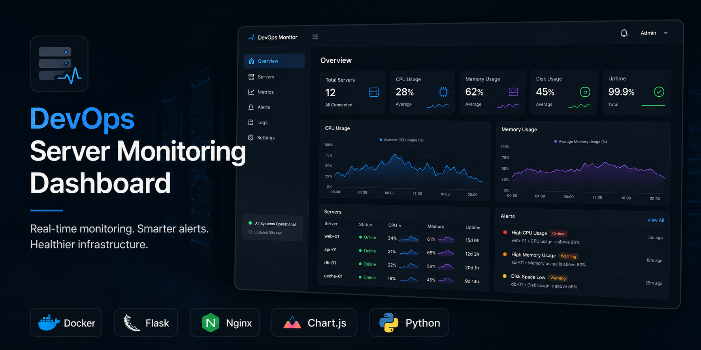
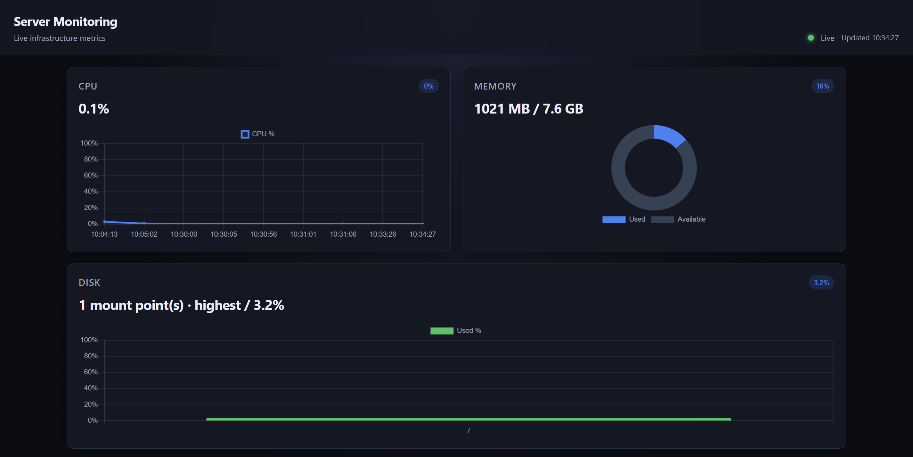
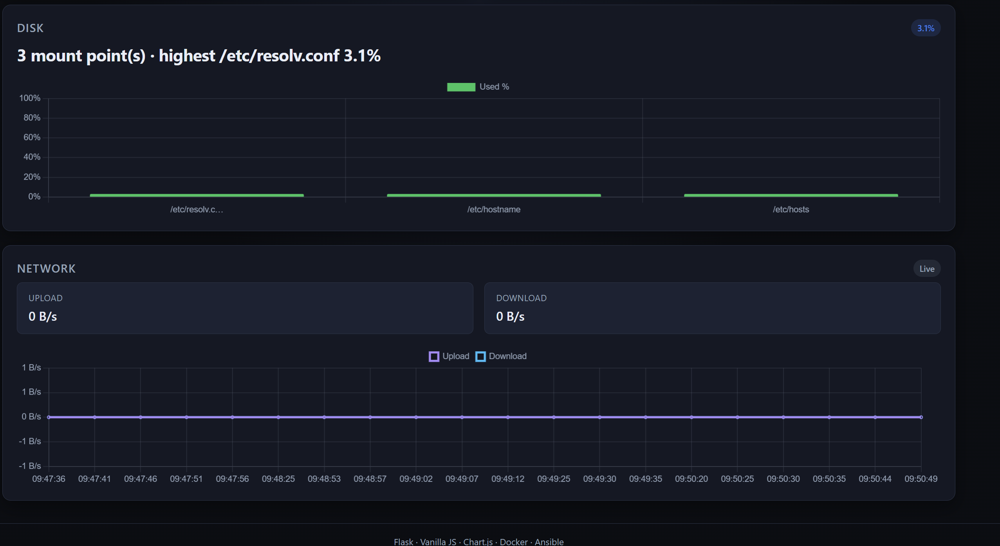

# DevOps Server Monitoring Dashboard


A self-hosted, Dockerized monitoring dashboard that reads **live** CPU, memory, disk, and network metrics from a Linux host and displays them in the browser. Built as a full-stack DevOps portfolio project — simple enough to explain in an interview, structured enough to look production-minded.



---

## Project Overview

Most monitoring tools (Grafana, Datadog, etc.) need heavy setup or paid tiers. This project is a **lightweight alternative** you can run on a VM or laptop: Flask collects metrics with `psutil`, Nginx serves the UI and proxies API traffic, and Docker Compose runs the whole stack with one command.

There is **no database** and **no message queue**. Metrics are read on each request and returned as JSON. The frontend polls a single aggregate endpoint every few seconds and renders charts with Chart.js.

**Good for:** DevOps / SRE / platform engineering portfolios, especially at fresher to intermediate level.

---

## Features

| Area | What you get |
|------|----------------|
| **CPU** | Live usage % with rolling line chart |
| **Memory** | Used / total (bytes) + doughnut chart |
| **Disk** | User-facing filesystems only (pseudo mounts filtered) |
| **Network** | Upload/download throughput (bytes/sec) |
| **Containers** | Running Docker containers via Docker SDK (when socket is mounted) |
| **Dashboard UX** | Dark responsive UI, loading state, error + alert banners, stale-data handling, retry |
| **API** | REST JSON with consistent envelope; aggregate `GET /api/metrics` |
| **Ops** | Docker Compose stack, Nginx reverse proxy, Ansible layout for Linux deploy |

---

## Tech Stack

| Layer | Technology | Role |
|-------|------------|------|
| Frontend | HTML, CSS, Vanilla JS | Dashboard UI, polling, DOM updates |
| Charts | Chart.js (CDN) | Line, doughnut, and bar charts |
| Backend | Python 3.11, Flask, Gunicorn | REST API, app factory + blueprints |
| Metrics | psutil | CPU, RAM, disk, network from the kernel |
| Containers | Docker SDK for Python | List running containers on the host |
| Proxy | Nginx (Alpine) | Static files + `/api/*` → Flask |
| Runtime | Docker, Docker Compose | Two-service stack on a bridge network |
| Automation | Ansible | Inventory, roles, playbook scaffold for deploy |
| Config | `.env` | Ports, thresholds, secrets |

---

## Architecture

```
┌─────────────────────────────────────────────────────────────┐
│                         Browser                              │
│              HTML / CSS / Vanilla JS / Chart.js              │
│         polls GET /api/metrics every ~3 seconds              │
└───────────────────────────┬─────────────────────────────────┘
                            │ HTTP (same origin)
┌───────────────────────────▼─────────────────────────────────┐
│                    Docker Compose (monitor-net)              │
│  ┌─────────────────────┐      ┌──────────────────────────┐ │
│  │  web (Nginx :80)    │─────▶│  api (Flask/Gunicorn :5000)│ │
│  │  • static frontend  │ /api │  • psutil → host metrics   │ │
│  │  • reverse proxy    │      │  • Docker SDK → containers │ │
│  └─────────────────────┘      └─────────────┬────────────┘ │
│                                              │ docker.sock   │
└──────────────────────────────────────────────┼───────────────┘
                                               ▼
                                    Host kernel + Docker daemon
```

**Request path:** Browser → Nginx → Flask → `psutil` / Docker SDK → JSON → Chart.js updates.

**Why Nginx in front?** Serves static assets efficiently and proxies `/api` so the browser never deals with CORS or a second origin in production.

---

## Screenshots

| Dashboard view | Detail |
|----------------|--------|
|  | Metric cards, CPU/memory charts, status header |
|  | Disk, network throughput, and layout on a wide screen |

---

## Folder Structure

```
.
├── backend/                    # Flask API
│   ├── app/
│   │   ├── routes/api.py       # HTTP endpoints
│   │   ├── services/           # metrics.py, containers.py
│   │   ├── utils/              # JSON response helpers
│   │   ├── config.py
│   │   └── __init__.py         # create_app()
│   ├── Dockerfile
│   ├── requirements.txt
│   ├── run.py                  # local dev
│   └── wsgi.py                 # Gunicorn entry
├── frontend/
│   ├── index.html
│   ├── css/style.css
│   └── js/
│       ├── api.js              # fetch /api/metrics
│       ├── charts.js           # Chart.js setup + updates
│       └── app.js              # polling, UI state
├── nginx/
│   ├── Dockerfile
│   └── nginx.conf
├── ansible/                    # deploy scaffold
│   ├── inventory/hosts.ini
│   ├── roles/
│   ├── vars/main.yml
│   └── playbook.yml
├── docs/                       # API.md, DEPLOYMENT.md, …
├── screenshots/
├── docker-compose.yml
├── .env.example
└── README.md
```

---

## API Endpoints

Base URL (via Nginx): `http://localhost:<WEB_PORT>/api`

| Endpoint | Method | Description |
|----------|--------|-------------|
| `/api/health` | GET | Liveness check |
| `/api/metrics` | GET | **Recommended** — CPU, memory, disk, network in one response |
| `/api/cpu` | GET | CPU usage % |
| `/api/memory` | GET | RAM bytes + percent |
| `/api/disk` | GET | Disk usage (filtered mount points) |
| `/api/network` | GET | Bytes sent/received per second |
| `/api/containers` | GET | Running Docker containers |

**Success envelope:**

```json
{
  "status": "ok",
  "timestamp": "2026-05-26T12:00:00+00:00",
  "data": { }
}
```

**Error envelope:**

```json
{
  "status": "error",
  "timestamp": "2026-05-26T12:00:00+00:00",
  "message": "Human-readable description",
  "code": "METRICS_ERROR"
}
```

Full examples: [docs/API.md](docs/API.md)

---

## Setup Instructions

### Prerequisites

- **Docker** 24+ and **Docker Compose** v2
- **Python** 3.11+ (optional, for local API development)
- **Git**

### Quick start (Docker — recommended)

```bash
git clone https://github.com/<your-username>/devops-server-monitoring-dashboard.git
cd devops-server-monitoring-dashboard

cp .env.example .env
docker compose up --build
```

Open the dashboard (default port from `.env`):

```text
http://localhost:3000
```

Health check:

```bash
curl http://localhost:3000/api/health
curl http://localhost:3000/api/metrics
```

> **Note:** `GET /api/metrics` takes about **2 seconds** per call (CPU interval + network sampling). The UI shows a loading state during that time.

### Local backend only (no Docker)

```bash
cd backend
python -m venv venv

# Windows
venv\Scripts\activate
# Linux / macOS
source venv/bin/activate

pip install -r requirements.txt
python run.py
```

API: `http://localhost:5000/api/health`

The frontend expects Nginx to proxy `/api`; for local UI testing, use the full Docker Compose stack.

---

## Docker Setup

| Service | Image build | Host port | Notes |
|---------|-------------|-----------|--------|
| `web` | `./nginx` | `${WEB_PORT:-8080}` → 80 | Serves `./frontend`, proxies `/api/` |
| `api` | `./backend` | internal 5000 | Mounts `docker.sock` (read-only) for container list |

**Compose commands:**

```bash
# Start in foreground
docker compose up --build

# Start detached
docker compose up --build -d

# View logs
docker compose logs -f

# Stop
docker compose down
```

**Environment variables** (`.env.example`):

| Variable | Purpose |
|----------|---------|
| `WEB_PORT` | Host port for the dashboard (e.g. `3000`) |
| `SECRET_KEY` | Flask secret |
| `CPU_THRESHOLD` / `RAM_THRESHOLD` / `DISK_THRESHOLD` | Frontend alert thresholds |
| `POLL_INTERVAL_MS` | Documented poll interval (UI uses 3000 ms in `app.js`) |

### Ansible (optional)

Scaffold for provisioning a Linux host is under `ansible/`. See [ansible/README.md](ansible/README.md) and [docs/DEPLOYMENT.md](docs/DEPLOYMENT.md).

```bash
ansible-playbook ansible/playbook.yml -i ansible/inventory/hosts.ini
```

---

## Challenges Faced

| Challenge | What happened | What I did |
|-----------|---------------|------------|
| **Docker port conflicts** | Port `3000` or `8080` already in use on the host | Changed `WEB_PORT` in `.env`, documented defaults in Compose |
| **Container vs host metrics** | `psutil` inside the API container reports cgroup limits, not always the full host | Documented behavior; mount/host visibility is a known trade-off for containerized agents |
| **Stale frontend polling** | Fixed `setInterval` overlapped with ~2s API latency; polls were skipped or stacked | Switched to **schedule next poll after request completes**; skip if a fetch is already in flight |
| **Noisy Docker mount points** | Disk API listed `/etc/resolv.conf`, `/etc/hostname`, etc. | Filtered pseudo and file bind-mounts in `metrics.py`; fallback to `/` |
| **Errors vs warnings** | Threshold alerts used the same red banner as fetch failures | Split **alert** (usage) and **error** (network/API) banners |
| **Long requests timing out** | Slow metrics collection looked like a hung UI | Added fetch timeout, loading banner, stale-data mode with last known charts |

---

## Engineering Decisions

| Decision | Choice | Reason |
|----------|--------|--------|
| Real-time transport | **HTTP polling** (not WebSockets) | Simpler to debug, works through proxies, enough for 3s refresh |
| Dashboard data | **`GET /api/metrics`** aggregate | One round-trip instead of four; less load on Gunicorn workers |
| Persistence | **None** | Live `psutil` reads are fast; no DB to operate or explain |
| Frontend | **Vanilla JS** modules (`api`, `charts`, `app`) | No build step; clear separation of concerns |
| Production server | **Gunicorn** + **Nginx** | Flask dev server is not for production; Nginx serves static files well |
| Docker layout | **Two containers** on `monitor-net` | API not exposed publicly; only Nginx published |
| Docker socket | **Read-only mount** into `api` | Required for container list; documented security trade-off |
| Disk metrics | **Filter pseudo mounts** | Cleaner UX than showing every container bind mount |
| Failed refresh | **Stale-data UI** + retry | Charts keep last good values; user can retry without a full reload |
| Chart updates | **`update('none')` after first draw** | Less flicker during polling |
| Background tabs | **Pause polling when hidden** | Avoids useless API traffic |

---

## Future Improvements

- [ ] Complete Ansible roles (`docker`, `security`, `deploy`) for one-command VM provisioning
- [ ] `pytest` suite for API routes and metric helpers
- [ ] Optional `GET /api/containers` on the same poll cycle or a second timed fetch
- [ ] Configurable poll interval from environment without editing `app.js`
- [ ] Host-level metrics in Docker (`pid: host` or dedicated node exporter sidecar) — documented in README/wiki
- [ ] Export last N samples to CSV from the browser
- [ ] GitHub Actions: build images and run tests on push

---

## Resume Value

Bullet points you can adapt (keep honest — describe what **you** built):

- Built a real-time server monitoring dashboard using **Flask**, **Chart.js**, and **Docker Compose**
- Collected live CPU, memory, disk, and network metrics with **psutil**; listed containers via the **Docker SDK**
- Designed a **reverse-proxy** setup (**Nginx** → **Gunicorn/Flask**) on a private Docker network
- Implemented an aggregate **`/api/metrics`** endpoint and polling-based UI with stale-data and error handling
- Containerized the stack with health checks, non-root API user, and read-only Docker socket mount
- Structured the repo for **Ansible**-based deployment and beginner-friendly modular JavaScript

**Interview talking points:** why polling vs WebSockets, why no database, how Nginx avoids CORS, what happens when the Docker socket is missing, how disk mount filtering works.

---

## Author

**Pratham**

- Portfolio / learning project — DevOps Server Monitoring Dashboard
- GitHub: [@your-username](https://github.com/your-username)
- LinkedIn: [your-profile](https://linkedin.com/in/your-profile)

Contributions and feedback are welcome. If you use this repo, a star helps — thanks.

---

## License

This project is intended for portfolio and educational use. Add a `LICENSE` file (e.g. MIT) if you publish the repository publicly.

---

## Related Docs

- [docs/API.md](docs/API.md) — request/response examples
- [docs/DEPLOYMENT.md](docs/DEPLOYMENT.md) — Docker and Ansible notes
- [docs/STRUCTURE.md](docs/STRUCTURE.md) — directory map
